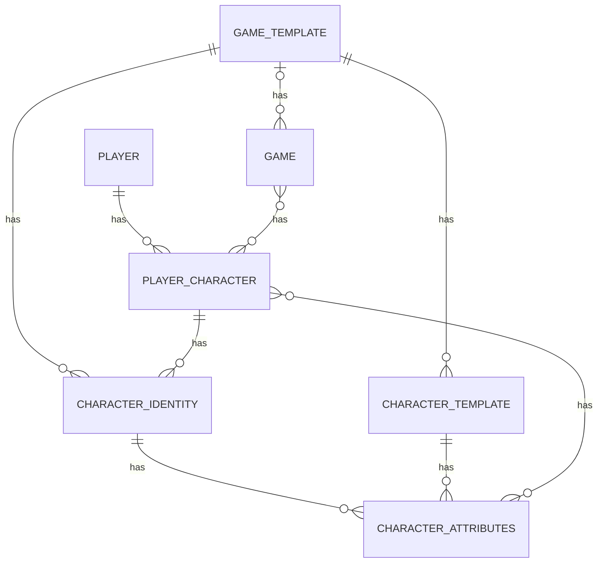

We need to make the DB model flexible enough to manage multiple game types. We will
discover many more attributes as we go along.

We will need to support:
- Stats
- Skills
- Items
- Techniques (Spells, Abilities)
- Abilities
- Additional Mechanics
- Templates for different game types
  - Character Templates
- Game Mechanics
- Character Identity (Class, Race, etc.)

